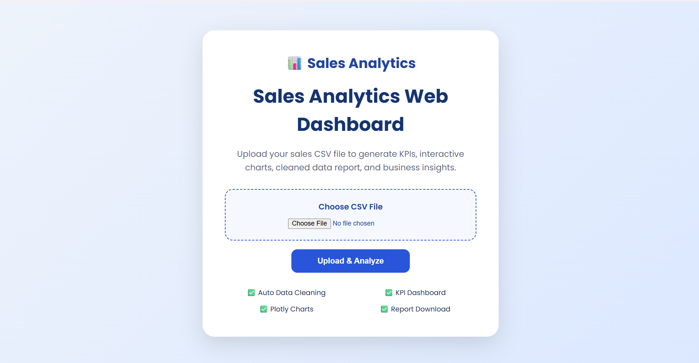

# 📊 Sales Analytics Web Dashboard

A professional Sales Analytics Dashboard built with **Flask**, **Pandas**, and **Plotly** that allows users to upload a sales CSV file, automatically clean the data, generate interactive dashboards, apply filters, download reports, and export executive PDF reports.

---

## 🚀 Live Demo


https://sales-analytics-web-dashboard.onrender.com/

---

## 📸 Project Preview

### Upload Page

> Add screenshot here



---

### Dashboard

> Add screenshot here


---

## ✨ Features

### 📂 Data Upload

- Upload any Sales CSV
- Automatic data validation
- Automatic data cleaning
- Duplicate removal
- Missing value handling

---

### 📊 Interactive Dashboard

- KPI Cards
- Total Sales
- Total Orders
- Average Sales
- Profit
- Profit Margin
- Top Region
- Customer Count
- Product Count
- Quantity Sold

---

### 📈 Interactive Charts

- Monthly Sales Trend
- Sales by Region
- Sales by Category
- Profit by Region
- Sales vs Profit
- Top 10 Products
- Top 10 Customers
- Quantity by Category

---

### 🔍 Dynamic Filters

- Region
- Category
- Segment
- Year
- Month

---

### 📋 Data Table

- Search
- Sorting
- Pagination
- Export CSV
- Export Excel
- Print

---

### 📄 Reports

- Download Cleaned CSV
- Executive PDF Report

---

### 🧠 Business Intelligence

Automatically generates

- Executive Summary
- Business Insights
- Recommendations

---

## 🛠️ Built With

- Python
- Flask
- Pandas
- Plotly
- ReportLab
- HTML5
- CSS3
- JavaScript
- DataTables

---

## 📂 Project Structure

```
sales-analytics-web-dashboard/
│
├── app.py
├── requirements.txt
├── README.md
├── .gitignore
│
├── utils/
│   └── pdf_report.py
│
├── static/
│   ├── style.css
│
├── templates/
│   ├── index.html
│   └── dashboard.html
│
├── uploads/
├── reports/
├── screenshots/
└── sample_data/
```

---

## ⚙️ Installation

Clone the repository

```bash
git clone https://github.com/Aadvik7462/sales-analytics-web-dashboard.git
```

Move into project

```bash
cd sales-analytics-web-dashboard
```

Create virtual environment

```bash
python -m venv venv
```

Activate

### Windows

```bash
venv\Scripts\activate
```

### Linux / macOS

```bash
source venv/bin/activate
```

Install dependencies

```bash
pip install -r requirements.txt
```

Run the application

```bash
python app.py
```

Open

```
http://127.0.0.1:5000
```

---

## 📊 Dashboard Capabilities

✔ Upload CSV

✔ Clean Data

✔ Interactive Charts

✔ Dynamic Filters

✔ Business KPIs

✔ Executive Insights

✔ Recommendations

✔ Download CSV

✔ Download PDF

✔ Responsive Layout

---

## 📈 Future Enhancements

- AI-powered insights
- Sales forecasting
- Dark mode
- User authentication
- Database integration
- Email reports
- Real-time dashboards

---

## 👨‍💻 Developer

**Aadvik Singh**

Electronics & Communication Engineering

Government Engineering College, Jamui

---

## 📄 License

This project is licensed under the MIT License.

---

## ⭐ Support

If you found this project useful, consider giving it a ⭐ on GitHub.
